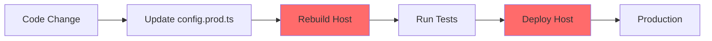
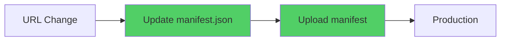

# Dynamic Module Federation with JSON Manifest

## Overview

This guide explains how to use **dynamic module federation** with JSON manifests instead of static configuration. Dynamic module federation allows you to achieve **"Build once, deploy everywhere"** by loading remote application URLs at runtime.

## Table of Contents

- [Why Use Dynamic Module Federation?](#why-use-dynamic-module-federation)
- [Static vs Dynamic Comparison](#static-vs-dynamic-comparison)
- [Setup Guide](#setup-guide)
- [Managing Dev vs Production Environments](#managing-dev-vs-production-environments)
- [Environment-Specific Manifests](#environment-specific-manifests)
- [Best Practices](#best-practices)
- [Troubleshooting](#troubleshooting)

---

## Why Use Dynamic Module Federation?

### The Problem with Static Configuration

With static module federation, remote URLs are hardcoded at **build time**:

```typescript
// module-federation.config.prod.ts
const config: ModuleFederationConfig = {
  name: 'mfeui',
  remotes: [
    ['products', 'https://cdn.example.com/products/remoteEntry.mjs'],
    ['cart', 'https://cdn.example.com/cart/remoteEntry.mjs'],
  ],
};
```

**Problems:**

- ❌ Must rebuild host app for every remote URL change
- ❌ Need separate builds for each environment (dev, staging, prod)
- ❌ Cannot test production build in staging environment
- ❌ Slow CI/CD pipelines (multiple builds)
- ❌ Difficult to manage when remotes are in different repos/domains
- ❌ No flexibility for A/B testing or canary deployments

### The Solution: Dynamic Module Federation

With dynamic module federation, remote URLs are loaded at **runtime**:

```json
// module-federation.manifest.json
{
  "products": "https://cdn.example.com/products/remoteEntry.mjs",
  "cart": "https://cdn.example.com/cart/remoteEntry.mjs"
}
```

**Benefits:**

- ✅ **Build once, deploy everywhere** - single build artifact for all environments
- ✅ Update remote URLs without rebuilding host
- ✅ Test exact production build in staging
- ✅ Fast deployments (just swap JSON file)
- ✅ Easy A/B testing and feature flags
- ✅ Perfect for multi-team, multi-repo scenarios
- ✅ Zero-downtime remote updates

---

## Static vs Dynamic Comparison

### Static Configuration Flow



**Time:** 30-60 minutes | **Risk:** High (full deployment)

### Dynamic Configuration Flow



**Time:** 2-5 minutes | **Risk:** Low (config only)

### Side-by-Side Comparison

| Aspect                | Static                         | Dynamic                    |
| --------------------- | ------------------------------ | -------------------------- |
| **Build Time**        | Separate build per environment | Single build for all       |
| **Deployment Speed**  | Slow (rebuild required)        | Fast (swap JSON)           |
| **URL Updates**       | Requires rebuild               | No rebuild needed          |
| **A/B Testing**       | Not possible                   | Easy                       |
| **Multi-Environment** | Multiple builds                | One build + multiple JSONs |
| **Team Independence** | Tightly coupled                | Loosely coupled            |
| **Risk Level**        | High (code deploy)             | Low (config change)        |
| **CI/CD Time**        | 20-40 min                      | 5-10 min                   |

---

## Setup Guide

### Step 1: Create Bootstrap File

Nx applications need a `bootstrap.ts` file to enable dynamic loading.

**apps/mfeui/src/bootstrap.ts**

```typescript
import { bootstrapApplication } from '@angular/platform-browser';
import { appConfig } from './app/app.config';
import { AppComponent } from './app/app.component';

bootstrapApplication(AppComponent, appConfig).catch((err) => console.error(err));
```

### Step 2: Update main.ts to Use Dynamic Loading

**apps/mfeui/src/main.ts**

```typescript
import { setRemoteDefinitions } from '@nx/angular/mf';

/**
 * Dynamic Module Federation Setup
 *
 * This fetches the module federation manifest at runtime,
 * allowing the same build to work across all environments.
 *
 * The manifest file can be swapped per environment without rebuilding.
 */
fetch('/module-federation.manifest.json')
  .then((res) => {
    if (!res.ok) {
      throw new Error(`Failed to load manifest: ${res.status} ${res.statusText}`);
    }
    return res.json();
  })
  .then((definitions) => {
    console.log('📦 Loading remote definitions:', definitions);
    setRemoteDefinitions(definitions);
  })
  .then(() => import('./bootstrap'))
  .catch((err) => {
    console.error('❌ Failed to load module federation manifest:', err);
    // Show user-friendly error
    document.body.innerHTML = `
      <div style="padding: 20px; font-family: Arial, sans-serif;">
        <h1 style="color: #ff6b6b;">Failed to Load Application</h1>
        <p>Unable to load module federation configuration.</p>
        <p>Please contact support if this issue persists.</p>
        <details>
          <summary>Technical Details</summary>
          <pre>${err.message}</pre>
        </details>
      </div>
    `;
  });
```

### Step 3: Clear Static Remotes from Config

**apps/mfeui/module-federation.config.ts**

```typescript
import { ModuleFederationConfig } from '@nx/module-federation';

const config: ModuleFederationConfig = {
  name: 'mfeui',
  /**
   * Dynamic Module Federation:
   * Remotes array is empty because we load them dynamically at runtime
   * via the module-federation.manifest.json file.
   *
   * This allows "Build once, deploy everywhere" pattern.
   */
  remotes: [], // Empty - loaded dynamically!
};

export default config;
```

### Step 4: Create Manifest Files for Each Environment

Create a `public` folder if it doesn't exist:

```bash
mkdir -p apps/mfeui/public
```

---

## Managing Dev vs Production Environments

### Development Manifest (Local Dev Servers)

**apps/mfeui/public/module-federation.manifest.json**

```json
{
  "products": "http://localhost:4201",
  "cart": "http://localhost:4202",
  "profile": "http://localhost:4203",
  "orders": "http://localhost:4204",
  "analytics": "http://localhost:4205",
  "notifications": "http://localhost:4206",
  "messages": "http://localhost:4207",
  "admin": "http://localhost:4208"
}
```

**For Development:**

```bash
# Terminal 1: Start host
nx serve mfeui

# Terminal 2: Start remote(s) you're working on
nx serve products
nx serve cart

# The host will load remotes from localhost URLs
```

### Production Manifest (Deployed URLs)

**apps/mfeui/public/module-federation.manifest.prod.json**

```json
{
  "products": "https://hemantajax.github.io/mfedemos/products/remoteEntry.mjs",
  "cart": "https://hemantajax.github.io/mfedemos/cart/remoteEntry.mjs",
  "profile": "https://hemantajax.github.io/mfedemos/profile/remoteEntry.mjs",
  "orders": "https://hemantajax.github.io/mfedemos/orders/remoteEntry.mjs",
  "analytics": "https://hemantajax.github.io/mfedemos/analytics/remoteEntry.mjs",
  "notifications": "https://hemantajax.github.io/mfedemos/notifications/remoteEntry.mjs",
  "messages": "https://hemantajax.github.io/mfedemos/messages/remoteEntry.mjs",
  "admin": "https://hemantajax.github.io/mfedemos/admin/remoteEntry.mjs"
}
```

### Staging Manifest (Staging URLs)

**apps/mfeui/public/module-federation.manifest.staging.json**

```json
{
  "products": "https://staging.example.com/products/remoteEntry.mjs",
  "cart": "https://staging.example.com/cart/remoteEntry.mjs",
  "profile": "https://staging.example.com/profile/remoteEntry.mjs",
  "orders": "https://staging.example.com/orders/remoteEntry.mjs",
  "analytics": "https://staging.example.com/analytics/remoteEntry.mjs",
  "notifications": "https://staging.example.com/notifications/remoteEntry.mjs",
  "messages": "https://staging.example.com/messages/remoteEntry.mjs",
  "admin": "https://staging.example.com/admin/remoteEntry.mjs"
}
```

---

## Environment-Specific Manifests

### Strategy 1: Copy Manifest During Deployment

**deployment-scripts/deploy.sh**

```bash
#!/bin/bash

ENV=$1  # dev, staging, prod

# Build once
echo "Building application..."
nx build mfeui --configuration=production

# Copy environment-specific manifest
echo "Copying manifest for environment: $ENV"
cp apps/mfeui/public/module-federation.manifest.$ENV.json \
   dist/apps/mfeui/browser/module-federation.manifest.json

# Deploy
echo "Deploying to $ENV..."
# Your deployment command here
```

**Usage:**

```bash
./deployment-scripts/deploy.sh staging
./deployment-scripts/deploy.sh prod
```

### Strategy 2: Server-Side Manifest Generation

For environments with a server, generate manifest dynamically:

**apps/mfeui/server/manifest.ts**

```typescript
import { Request, Response } from 'express';

const MANIFESTS = {
  development: {
    products: 'http://localhost:4201',
    cart: 'http://localhost:4202',
    // ... other remotes
  },
  staging: {
    products: 'https://staging.example.com/products/remoteEntry.mjs',
    cart: 'https://staging.example.com/cart/remoteEntry.mjs',
    // ... other remotes
  },
  production: {
    products: 'https://cdn.example.com/products/remoteEntry.mjs',
    cart: 'https://cdn.example.com/cart/remoteEntry.mjs',
    // ... other remotes
  },
};

export function getManifest(req: Request, res: Response) {
  const env = process.env.NODE_ENV || 'development';
  const manifest = MANIFESTS[env];

  res.json(manifest);
}
```

### Strategy 3: Environment Variables in CI/CD

**GitHub Actions Example:**

```yaml
name: Deploy Host Application

on:
  push:
    branches: [main, staging]

jobs:
  deploy:
    runs-on: ubuntu-latest
    steps:
      - uses: actions/checkout@v3

      # Build once
      - name: Build application
        run: nx build mfeui --configuration=production

      # Copy environment-specific manifest
      - name: Setup manifest for staging
        if: github.ref == 'refs/heads/staging'
        run: |
          cp apps/mfeui/public/module-federation.manifest.staging.json \
             dist/apps/mfeui/browser/module-federation.manifest.json

      - name: Setup manifest for production
        if: github.ref == 'refs/heads/main'
        run: |
          cp apps/mfeui/public/module-federation.manifest.prod.json \
             dist/apps/mfeui/browser/module-federation.manifest.json

      # Deploy
      - name: Deploy
        run: npm run deploy
```

---

## Development Workflow

### Scenario 1: Working on Host Only

```bash
# Use development manifest (localhost URLs)
nx serve mfeui

# All remotes load from localhost (must be running)
```

### Scenario 2: Working on Specific Remote

```bash
# Terminal 1: Host
nx serve mfeui

# Terminal 2: Remote you're developing
nx serve products

# Terminal 3 (optional): Other remotes load from production
# (just don't start their dev servers)
```

### Scenario 3: Mixed Local + Production Remotes

**apps/mfeui/public/module-federation.manifest.json** (development)

```json
{
  "products": "http://localhost:4201",
  "cart": "http://localhost:4202",
  "profile": "https://hemantajax.github.io/mfedemos/profile/remoteEntry.mjs",
  "orders": "https://hemantajax.github.io/mfedemos/orders/remoteEntry.mjs",
  "analytics": "https://hemantajax.github.io/mfedemos/analytics/remoteEntry.mjs",
  "notifications": "https://hemantajax.github.io/mfedemos/notifications/remoteEntry.mjs",
  "messages": "https://hemantajax.github.io/mfedemos/messages/remoteEntry.mjs",
  "admin": "https://hemantajax.github.io/mfedemos/admin/remoteEntry.mjs"
}
```

**Start only what you need:**

```bash
# Terminal 1: Host
nx serve mfeui

# Terminal 2: Remotes you're actively developing
nx serve products
nx serve cart

# Other remotes load from production URLs automatically!
```

### Scenario 4: Test Against Staging

**Create a temporary manifest:**

```json
{
  "products": "http://localhost:4201",
  "cart": "https://staging.example.com/cart/remoteEntry.mjs",
  "profile": "https://staging.example.com/profile/remoteEntry.mjs",
  "orders": "https://staging.example.com/orders/remoteEntry.mjs",
  "analytics": "https://staging.example.com/analytics/remoteEntry.mjs",
  "notifications": "https://staging.example.com/notifications/remoteEntry.mjs",
  "messages": "https://staging.example.com/messages/remoteEntry.mjs",
  "admin": "https://staging.example.com/admin/remoteEntry.mjs"
}
```

Now you can test your local changes with staging remotes!

---

## Update project.json for Public Assets

Ensure the manifest files are copied during build:

**apps/mfeui/project.json**

```json
{
  "targets": {
    "build": {
      "executor": "@nx/angular:webpack-browser",
      "options": {
        "assets": [
          "apps/mfeui/src/favicon.ico",
          "apps/mfeui/src/assets",
          {
            "input": "apps/mfeui/public",
            "glob": "**/*",
            "output": "/"
          }
        ]
      }
    }
  }
}
```

This ensures `module-federation.manifest.json` is copied to the build output.

---

## Route Configuration

Update your routes to use `loadRemoteModule`:

**apps/mfeui/src/app/app.routes.ts**

```typescript
import { Route } from '@angular/router';
import { loadRemoteModule } from '@nx/angular/mf';

export const appRoutes: Route[] = [
  {
    path: '',
    loadChildren: () => import('./home/home.routes').then((m) => m.homeRoutes),
  },
  {
    path: 'products',
    loadChildren: () => loadRemoteModule('products', './Routes').then((m) => m.remoteRoutes),
  },
  {
    path: 'cart',
    loadChildren: () => loadRemoteModule('cart', './Routes').then((m) => m.remoteRoutes),
  },
  {
    path: 'profile',
    loadChildren: () => loadRemoteModule('profile', './Routes').then((m) => m.remoteRoutes),
  },
  {
    path: 'orders',
    loadChildren: () => loadRemoteModule('orders', './Routes').then((m) => m.remoteRoutes),
  },
  {
    path: 'analytics',
    loadChildren: () => loadRemoteModule('analytics', './Routes').then((m) => m.remoteRoutes),
  },
  {
    path: 'notifications',
    loadChildren: () => loadRemoteModule('notifications', './Routes').then((m) => m.remoteRoutes),
  },
  {
    path: 'messages',
    loadChildren: () => loadRemoteModule('messages', './Routes').then((m) => m.remoteRoutes),
  },
  {
    path: 'admin',
    loadChildren: () => loadRemoteModule('admin', './Routes').then((m) => m.remoteRoutes),
  },
];
```

The `loadRemoteModule` function:

1. Checks if the remote is loaded
2. If not, loads it using the URL from `setRemoteDefinitions`
3. Returns the requested module

---

## Best Practices

### 1. Manifest Versioning

Add version information to track changes:

```json
{
  "_version": "1.2.0",
  "_updated": "2025-10-21T10:30:00Z",
  "_environment": "production",
  "products": "https://cdn.example.com/products/remoteEntry.mjs",
  "cart": "https://cdn.example.com/cart/remoteEntry.mjs"
}
```

### 2. Fallback Strategy

Handle missing remotes gracefully:

```typescript
fetch('/module-federation.manifest.json')
  .then((res) => res.json())
  .then((definitions) => {
    // Add fallback URLs
    const definitionsWithFallback = {
      ...definitions,
      products: definitions.products || 'https://cdn.example.com/products/remoteEntry.mjs',
    };
    setRemoteDefinitions(definitionsWithFallback);
  })
  .then(() => import('./bootstrap'));
```

### 3. Cache Busting

Add version/hash to manifest URL:

```typescript
const manifestUrl = `/module-federation.manifest.json?v=${Date.now()}`;
fetch(manifestUrl).then((res) => res.json());
// ...
```

### 4. Feature Flags

Use manifest for feature toggling:

```json
{
  "products": "https://cdn.example.com/products/remoteEntry.mjs",
  "cart": "https://cdn.example.com/cart/remoteEntry.mjs",
  "analytics": null,
  "_features": {
    "analytics": false,
    "newCheckout": true
  }
}
```

### 5. A/B Testing

Route users to different versions:

```json
{
  "products": "https://cdn.example.com/products-v2/remoteEntry.mjs",
  "cart": "https://cdn.example.com/cart-beta/remoteEntry.mjs"
}
```

### 6. Health Checks

Validate remotes are accessible:

```typescript
async function validateManifest(definitions: Record<string, string>) {
  const checks = Object.entries(definitions).map(async ([name, url]) => {
    try {
      const response = await fetch(url, { method: 'HEAD' });
      return { name, url, available: response.ok };
    } catch {
      return { name, url, available: false };
    }
  });

  const results = await Promise.all(checks);
  results.forEach(({ name, url, available }) => {
    console.log(`${available ? '✅' : '❌'} ${name}: ${url}`);
  });
}
```

---

## Troubleshooting

### Issue 1: Manifest Not Found (404)

**Symptoms:**

```
Failed to load manifest: 404 Not Found
```

**Solutions:**

1. Verify `public` folder is in `assets` configuration in `project.json`
2. Check manifest file exists: `apps/mfeui/public/module-federation.manifest.json`
3. Clear browser cache
4. Verify deployment copied the manifest file

### Issue 2: CORS Errors

**Symptoms:**

```
Access to fetch at 'https://cdn.example.com/...' from origin 'http://localhost:4200'
has been blocked by CORS policy
```

**Solutions:**

1. Configure CORS headers on remote server
2. For development, use a proxy configuration
3. Ensure remotes are deployed with proper CORS headers

**apps/mfeui/proxy.conf.json**

```json
{
  "/api": {
    "target": "https://cdn.example.com",
    "secure": false,
    "changeOrigin": true
  }
}
```

### Issue 3: Remote Not Loading

**Symptoms:**

```
Error loading remote: products
```

**Solutions:**

1. Check browser console for the exact error
2. Verify remote URL is correct and accessible
3. Ensure remote is built and deployed
4. Check network tab for failed requests
5. Verify remote's `remoteEntry.mjs` exists

### Issue 4: Development Mode Not Working

**Symptoms:**

- Host can't find remotes on localhost
- Connection refused errors

**Solutions:**

1. Ensure remote dev servers are running:
   ```bash
   nx serve products
   nx serve cart
   ```
2. Verify ports match manifest:
   ```json
   {
     "products": "http://localhost:4201" // Check project.json for port
   }
   ```
3. Check if ports are already in use

### Issue 5: Wrong Environment Manifest

**Symptoms:**

- Production loads localhost URLs
- Development loads production URLs

**Solutions:**

1. Verify correct manifest is deployed
2. Check deployment script copies correct file
3. Clear browser cache
4. Check build output contains correct manifest

---

## Migration Checklist

Use this checklist to migrate from static to dynamic module federation:

- [ ] Create `bootstrap.ts` file
- [ ] Update `main.ts` to fetch manifest
- [ ] Clear `remotes` array in `module-federation.config.ts`
- [ ] Create `public` folder
- [ ] Create development manifest (localhost URLs)
- [ ] Create production manifest (deployed URLs)
- [ ] Create staging manifest (if needed)
- [ ] Update `project.json` assets configuration
- [ ] Update routes to use `loadRemoteModule`
- [ ] Test locally with dev manifest
- [ ] Test build with production manifest
- [ ] Update CI/CD to copy correct manifest
- [ ] Deploy and verify
- [ ] Document environment-specific URLs for team

---

## Summary

### Key Takeaways

✅ **Dynamic module federation enables "Build once, deploy everywhere"**

- Single build artifact for all environments
- Swap JSON manifest per environment

✅ **Development workflow is flexible**

- Mix local dev servers with production remotes
- Only run remotes you're actively working on

✅ **Production deployments are faster and safer**

- Update remote URLs without rebuilding host
- Zero-downtime updates

✅ **Perfect for multi-team scenarios**

- Teams can deploy independently
- Remotes can be in different repos/domains

### When to Use Dynamic Module Federation

Use **Dynamic** when:

- Multiple environments (dev, staging, prod)
- Remotes in different repos/domains
- Multiple teams managing different remotes
- Need flexibility for A/B testing
- Want faster CI/CD pipelines

Use **Static** when:

- Simple single-environment setup
- All remotes in same monorepo
- Don't need environment flexibility
- Minimal deployment complexity

---

## Additional Resources

- [Nx Module Federation Documentation](https://nx.dev/recipes/module-federation)
- [Webpack Module Federation](https://webpack.js.org/concepts/module-federation/)
- [Angular Module Federation](https://www.angulararchitects.io/en/blog/module-federation-light/)

---

**Created:** October 2025  
**Last Updated:** October 2025  
**Version:** 1.0.0
